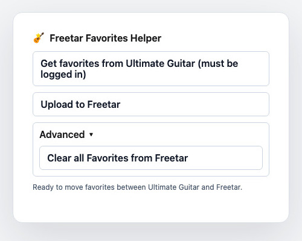
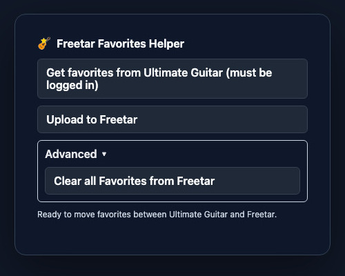

# Freetar Favorites Helper

> A Chrome extension that moves your saved Ultimate Guitar tabs into [Freetar](https://freetar.de).

<p align="center">
  <a href="https://chromewebstore.google.com/detail/freetar-favorites-helper/gokeajiiflpbanjfjacdclbkapikbdga">
    
  </a>
</p>

<p align="center">
  <a href="https://chromewebstore.google.com/detail/freetar-favorites-helper/gokeajiiflpbanjfjacdclbkapikbdga">
    <strong>Install from the Chrome Web Store</strong>
  </a>
</p>

---

## What it does

- Downloads your favorites from [Ultimate Guitar](https://www.ultimate-guitar.com/user/mytabs)
- Exports them as a Freetar-compatible JSON file
- Imports that JSON into any running Freetar tab

## Preview

<p align="center">
  
  &nbsp;
  
</p>

## How to use

1. Open a logged-in Ultimate Guitar tab.
2. Click the extension and choose **Download favorites**.
3. Open a Freetar tab such as [freetar.de](https://freetar.de).
4. Click the extension and choose **Upload favorites**, then select the downloaded `freetar-favorites.json`.
5. Use **Advanced** if you need to clear saved favorites from Freetar first.

## References

- Firefox alternative / reference: [Export Ultimate Guitar Favourites](https://github.com/tanouvelle/Export-Ultimate-Guitar-Favourites)

## Development

```sh
npm test
npm run zip
```
